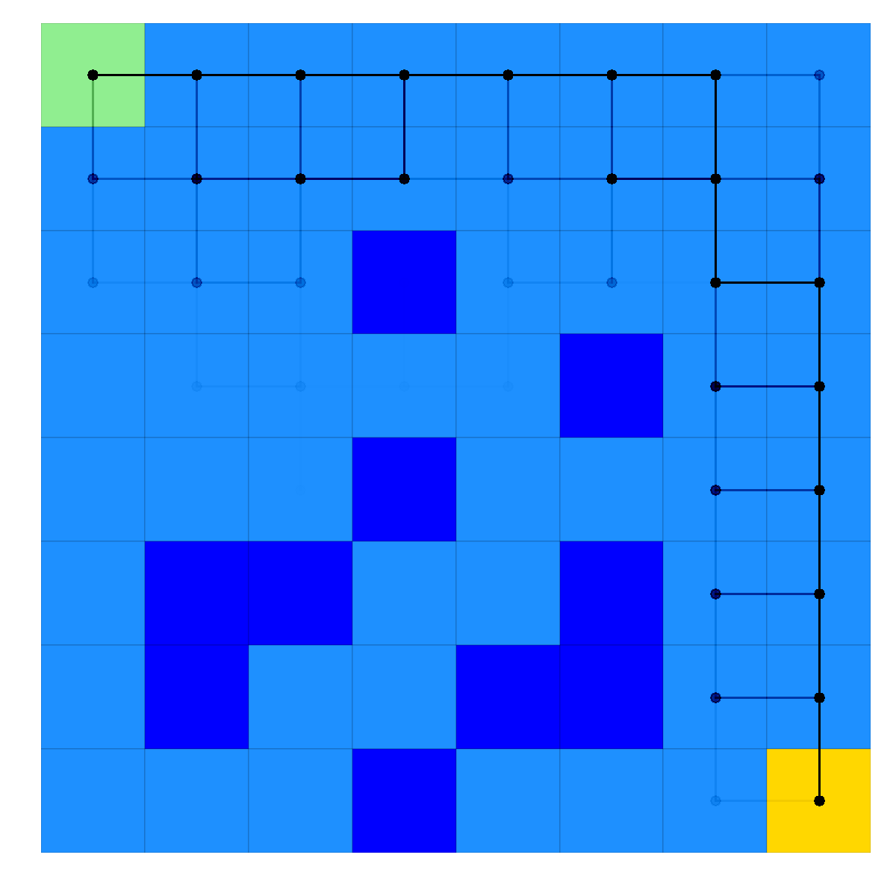
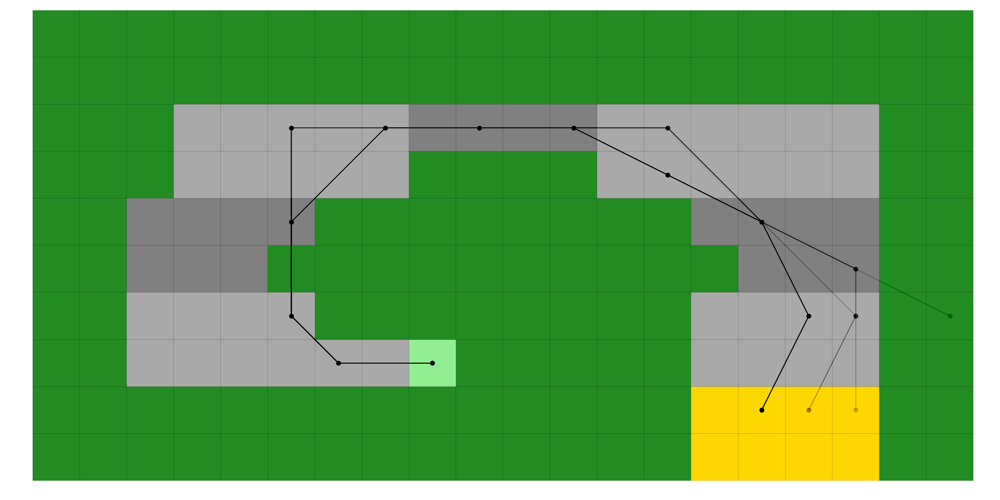
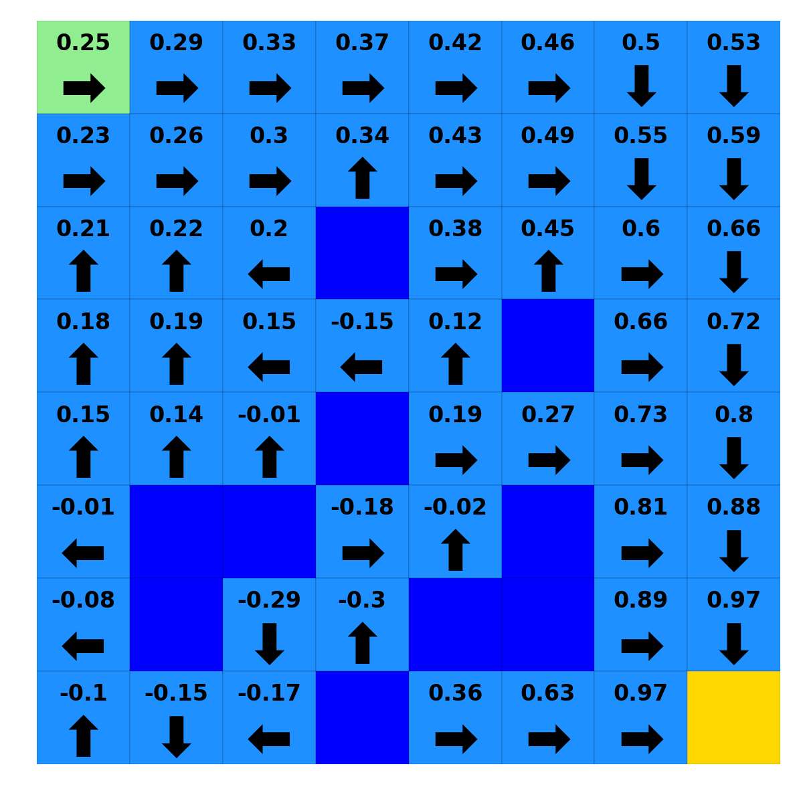

General
=======

Overview
--------

lrl is a Python package for applying (and hopefully, learning!) basic Reinforcement Learning algorithms.  It is intended to be an early stepping stone for someone trying to understanding the basic concepts of planning and learning, providing out-of-the-box implementations of some simple environments and algorithms in a well documented, readable, and digestible way to give someone platform from which to build understanding.

The overall goal of the author in writing this package was to provide people interested in Reinforcement Learning a starting point and handrail to help them as they began learning.  The fastest, most efficient implementation is less important here than code which can be read and learned from by someone new to the topic and with intermediate Python skills.

The idea behind this package originated as material to support students completing the Georgia Tech OMSCS class CS 7641: Machine Learning.  CS 7641 takes a top-down approach to learning Machine Learning, whereby students are encouraged to find existing implementations of the algorithms discussed and apply them to gain a feel for their overall properties and pitfalls.  While Python implementations for Supervised Learning are well represented (`scikit-learn <https://scikit-learn.org/>`_) and a student-driven project for Randomized Optimization and Search (`mlrose <https://mlrose.readthedocs.io/>`_) is available, robust and well-commented implementations for simple Reinforcement Learning were less ubiquitous.  This package attempts to fill that void.

The source code was written by Andrew Scribner and is available on `GitHub <https://github.com/ca-scribner/lrl>`_.

Content
-------

Implemented here are two common planning algorithms and one common learning algorithm:

* Value Iteration
* Policy Iteration
* Q-Learning

All three are implemented with a common API so that they can easily be run and compared to one another.

Also provided here for solving are two gridworld environments:

* RewardingFrozenLake
* Racetrack

RewardingFrozenLake is a cautionary tale about why you shouldn't throw a frisbee near a partially frozen lake.  The goal of the environment is to traverse a partially frozen lake from a starting position (where you are) to a goal position (where your frisbee is located) without falling through any of the holes in the ice.  The state space in this environment is integer (x, y) position and actions are movement (up, down, left, right), but as the ice surface is...well...ice, movements are not always as expected (an action moving in one direction may result in you going in a direction 90 degrees from your choice).  The implementation used here is a a slightly modified version of `this <https://github.com/cmaron/CS-7641-assignments/tree/master/assignment4>`_, which is itself a moderately modified version of `this <https://github.com/openai/gym/blob/master/gym/envs/toy_text/frozen_lake.py>`_.

   Example application of an optimal solution to a RewardingFrozenLake map, where the paths obtained are from 100 episodes in the environment following the optimal solution (stochasticity causes many paths to be explored)

Racetrack is a simulation of a car driving on a track from one or more starting positions to one or more finish positions, inspired by `Sutton and Barto's Reinforcement Learning <http://www.incompleteideas.net/book/the-book.html)>`_ (exercise 5.8) and coded by the present author.  It incorporates a more complicated state function of integer (x, y) position and velocity, with actions being vehicle acceleration.  Stochasticity is introduced through oily grid tiles, and failure through terminal grass tiles surrounding tracks.

   Example application of an optimal solution to a Racetrack map, where the paths obtained are from 100 episodes in the environment following the optimal solution (stochasticity causes many paths to be explored)

A non-exhaustive set of plotting scripts to display the calculated solutions to the environments is also included, as well as usage examples.  The hope is that users will apply the package as written, realize they want to dig deeper into a particular aspect or add some feature they read about in literature, and then add that to the existing codebase.

TODO: Add xy plot of something here

   Example solution to RewardingFrozenLake, where numbers show the value of each location and arrows show the optimal policy

Installation Instructions
-------------------------

For now, simply clone the package from `GitHub <https://github.com/ca-scribner/lrl>`_, drop it into a subfolder of your working directory, and import as required (for example, like in examples/example_experiment.py).

Future plans are to build this as a fully qualified package to be installed through pip.

Acknowledgements and Contributions
----------------------------------

Significance guidance and inspiration was taken from two related previous codebases (`here <https://github.com/cmaron/CS-7641-assignments/tree/master/assignment4>`_, and `here <https://github.gatech.edu/mmallo3/CS7641_Project4>`_, with apologies for access to the second link being restricted).  Although the present codebase is nearly original (with exceptions being cited directly in the codebase), the above works were instrumental in inspiring this package and in many ways this package should be seen as an incremental work off these previous projects.

Future contributions are encouraged and hoped for.  If you find a bug, build a new environment, implement a new feature, or have a great example that would help others then please contribute.  The only requirement for contributions is that they should be well commented and documented (using formatting that Sphinx will understand for the docs, etc.).