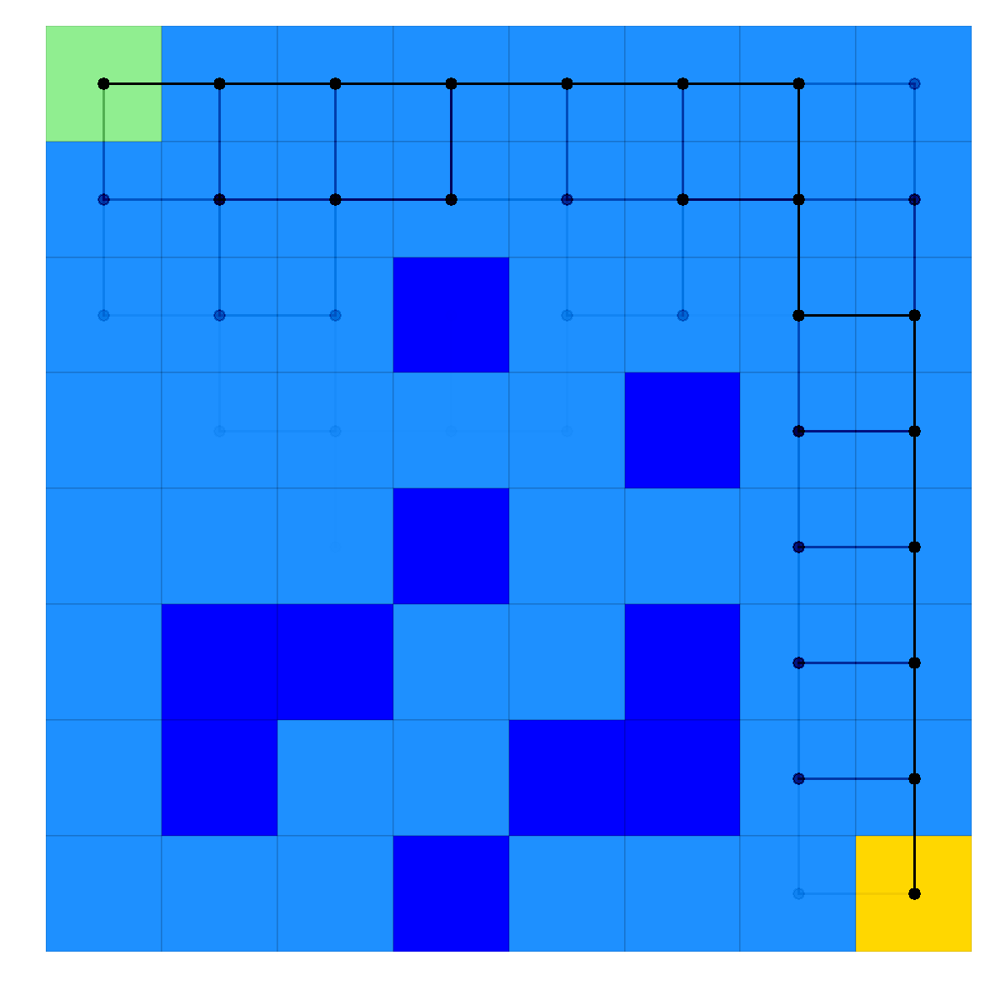

lrl: Learn Reinforcement Learning
=================================

lrl is a Python package for applying (and hopefully, learning!) basic Reinforcement Learning algorithms.  It is intended to be an early stepping stone for someone trying to understanding the basic concepts of planning and learning, providing out-of-the-box implementations of some simple environments and algorithms in a well documented, readable, and digestible way to give someone platform from which to build understanding.  

Within minutes, you'll be able to make fun images of your agent exploring an environment like these!

|pic1| |pic2|

.. |pic2| image::  racetrack_solved_example.png
   :width: 45%

The source code was written by Andrew Scribner and is available on `GitHub <https://github.com/ca-scribner/lrl>`_.

.. toctree::
   :maxdepth: 3

   general
   tutorials
   api

..   example_solution_frozen_lake

Indices and tables
==================

* :ref:`genindex`
* :ref:`modindex`
* :ref:`search`

